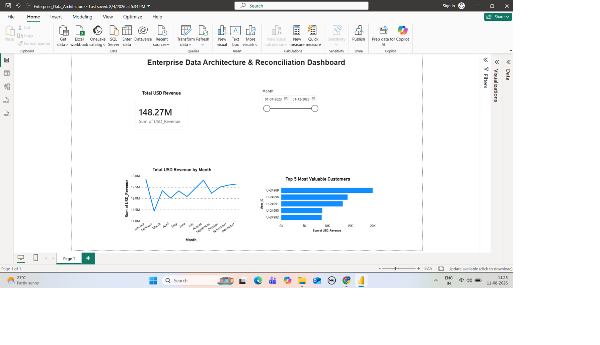

# Enterprise Data Architecture & Reconciliation

## Data Analytics Internship Project

### Project Overview

This project focuses on building an end-to-end data analytics pipeline for integrating, cleaning, reconciling, and analyzing financial data from multiple enterprise data sources.

The project uses Python, SQL, Pandas, Regular Expressions, and Power BI to transform raw data into an analysis-ready dataset and an interactive financial dashboard.

---

## Problem Statement

A FinTech organization stores its business data across multiple disconnected systems, making it difficult to generate accurate financial reports and audit-ready insights.

### Key Challenges

- User records contain multiple historical entries.
- Transaction data is stored as unstructured server logs.
- Daily exchange rate data contains missing weekend values.
- Data from different sources needs to be integrated into a single reliable dataset.
- Business stakeholders require an interactive dashboard for revenue and customer analysis.

---

## Project Objective

To build an automated data analytics pipeline that extracts, cleans, reconciles, and integrates data from multiple sources and creates an interactive Power BI dashboard for financial analysis and decision-making.

---

## Project Workflow

### Phase 1: SQL Extraction

- Connected to the SQLite database.
- Retrieved the latest record for each user.
- Filtered users whose latest status was `Active`.

### Phase 2: Regex & Data Cleaning

- Loaded raw server log data.
- Removed records containing `ERROR`.
- Used Regular Expressions to extract:
  - Date
  - User ID
  - Product ID
  - Euro Value

### Phase 3: Financial Reconciliation

- Loaded daily EUR-to-USD exchange rates.
- Handled missing weekend exchange rates using forward fill.
- Merged transaction data with exchange rates.
- Merged the result with active user data.
- Calculated `USD_Revenue`.

### Phase 4: Dashboard Creation

- Prepared the final analysis-ready dataset.
- Created an interactive Power BI dashboard.
- Visualized financial performance and customer insights.

---

## Tools & Technologies

| Tool | Purpose |
|---|---|
| Python | Data extraction, transformation and automation |
| Pandas | Data cleaning, manipulation and merging |
| SQLite | SQL-based data extraction |
| Regular Expressions | Parsing unstructured server logs |
| Matplotlib | Data visualization |
| Power BI | Interactive dashboard and business reporting |

---

## Key Techniques

- SQL Data Extraction
- SQL Window Functions / Latest Record Selection
- Regular Expressions
- Data Cleaning & Preprocessing
- Data Integration & Merging
- Missing Value Handling
- Forward Fill
- Financial Revenue Calculation
- Data Visualization
- Power BI Dashboard Development

---

## Dashboard

The Power BI dashboard provides:

- Total USD Revenue
- Monthly Revenue Trend
- Top 5 Most Valuable Customers
- Interactive Month Filtering

---
### Dashboard Preview

## Key Results

- Successfully extracted the latest active user records.
- Processed and cleaned unstructured server log data.
- Handled missing weekend exchange rates.
- Integrated multiple enterprise datasets.
- Calculated USD revenue from Euro transaction values.
- Created an interactive Power BI dashboard for financial analysis.

---

## Key Learning Outcomes

Through this project, I gained practical experience in:

- SQL Data Extraction
- Python & Pandas
- Data Cleaning
- Regular Expressions
- Data Integration
- Financial Data Analysis
- Power BI Dashboard Development
- Data Visualization
- Business Reporting

---

## Project Files

| File | Description |
|---|---|
| `Student_work_file_main.ipynb` | Jupyter Notebook containing the complete data processing workflow |
| `Enterprise_Data_Architecture.pbix` | Power BI dashboard project |
| `dashboard__.png` | Power BI dashboard screenshot |
| `Enterprise_Data_Architecture_Internship_Project____.pptx` | Internship project presentation |

> **Note:** Internship-provided/raw datasets are not included unless permitted for public distribution.

---

## Author

**Meenal Upadhyay**

Data Analytics Internship Project
